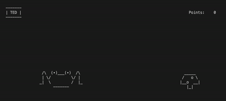

# FroggySecurity

This froggy game is written by Team Buffer Busters to demonstrate a buffer overflow vulnerability.
There are 2 parts to this project. The first part is a C++ program that allows the inputted frog name to buffer overflow. Try it yourself to gain extra points or make the game behave weirdly. These issues are fixed in the second part, which is the Rust version of the game.

## Running

**froggy_cpp**

The C++ version of this game can only be run on windows. The buffer overflow works with the Visual Studio compiler bug may not work with other compilers.

**froggy_rust**

The Rust version of this program can be run on all operating systems but looks best on mac/linux (because of the slow Windows terminal clearing).

To compile and run this program on mac/linux, cd into the `froggy_rust` directory and run `cargo run`.

**Playing the Game**

Once the program is started you will be prompted to enter your frog's name (try buffer overflowing here). After entering a name, the game will start in 3 seconds. Press the space bar to make your frog jump to avoid the poisonous mushroom. If you crash into the mushroom, you die. In the Rust version, you can win the game if your reach 1000 points, good luck!

## Demo
In the `demo` directory there are also 3 examples that showcase how code is written in Rust vs C++.

## Main References
- https://doc.rust-lang.org/book/
- ChatGPT: Used to learn Rust and debug the Rust program.
